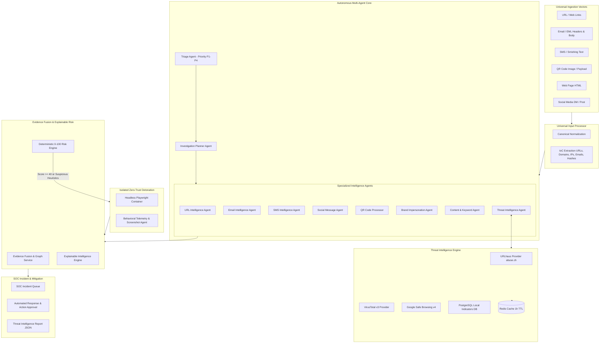

# ThreatLens Architecture Overview

ThreatLens is an autonomous, risk-adaptive cybersecurity investigation and threat intelligence platform designed to ingest, decompose, analyze, and neutralize multi-vector malicious campaigns in real time.

---

## Key Subsystems

### 1. Universal Input Normalization & Extraction
- Accepts arbitrary user inputs across 6 vectors (URLs, raw RFC822 EML emails, SMS texts, uploaded QR images/data URIs, Web Page HTML, and Social Media posts).
- Normalizes canonical formats and extracts indicators of compromise (URLs, nested domains, IP addresses, email addresses, cryptographic hashes).

### 2. Autonomous Multi-Agent Orchestration
- **Triage Agent:** Evaluates raw indicators and assigns priority (`P1_CRITICAL`, `P2_HIGH`, `P3_MEDIUM`, `P4_LOW`).
- **Investigation Planner Agent:** Analyzes the target structure and dynamically schedules specialized workers.
- **Concurrent Execution:** Dispatches agents concurrently via async event loop / Celery workers.

### 3. Real Threat Intelligence Providers & Redis Caching
- **URLhaus (`abuse.ch`):** Direct API querying using secret backend API key (`URLHAUS_AUTH_KEY`).
- **VirusTotal v3:** Correlates file hashes, domains, and IP reputations.
- **Google Safe Browsing v4:** Checks malicious social engineering and malware lists.
- **PostgreSQL Indicators Database:** Local indexed storage of confirmed threats.
- **Redis Cache Layer:** In-memory caching with 3600-second TTL prevents rate limit exhaustion.

### 4. Zero-Trust Playwright Sandbox
- Suspicious URLs (risk score $\ge 40$ or evasive heuristics) are detonated inside an isolated headless browser container.
- Captures DOM structure, console errors, network requests, redirects, and full-page visual screenshots without executing untrusted code on the host.

### 5. Explainable Risk Engine & Evidence Fusion
- Maps multi-agent evidence into a normalized graph.
- Calculates an explainable 0–100 risk score:
  - `0 - 19`: **SAFE**
  - `20 - 39`: **LOW**
  - `40 - 59`: **MEDIUM / SUSPICIOUS**
  - `60 - 79`: **HIGH**
  - `80 - 100`: **CRITICAL**
  - Missing or unverified data defaults strictly to **UNKNOWN**.
- Produces evidence-based "Why is this risky?" explanations and actionable mitigation steps.
