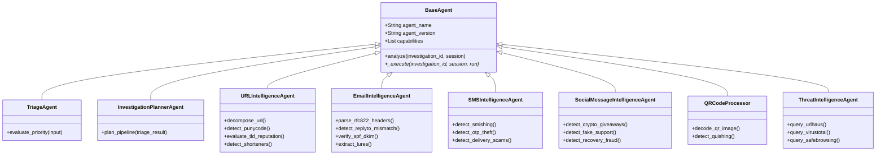

# ThreatLens Specialized Intelligence Agents

ThreatLens employs 9 specialized agents that work collaboratively to assess threats.

---

## Agent Specifications

### 1. Triage Agent (`triage_agent.py`)
- **Capabilities:** Priority assignment (`P1_CRITICAL`, `P2_HIGH`, `P3_MEDIUM`, `P4_LOW`).
- **Logic:** Inspects keywords, input length, and urgency cues to allocate computing resources.

### 2. Investigation Planner Agent (`investigation_planner.py`)
- **Capabilities:** Dynamic worker scheduling.
- **Logic:** Maps input types (URL, Email, SMS, QR, Social) to necessary analysis agents.

### 3. URL Intelligence Agent (`url_agent.py`)
- **Capabilities:** Deep decomposition, IP-in-URL detection, Punycode/IDN homographs, suspicious TLD detection (`.top`, `.xyz`, `.click`, `.buzz`, `.cfd`, `.rest`), URL shortener detection (`bit.ly`, `tinyurl.com`, `t.co`), non-standard ports, and credential harvesting keywords.

### 4. Email Intelligence Agent (`email_agent.py`)
- **Capabilities:** RFC822 parser, Reply-To vs From domain mismatches, SPF/DKIM authentication flags, psychological pressure, financial invoice fraud lures, embedded URL extraction and forwarding.

### 5. SMS Intelligence Agent (`sms_agent.py`)
- **Capabilities:** Smishing classification, OTP / 2FA interception detection, bank fraud alerts, parcel tracking scams, urgency lures, embedded link forwarding.

### 6. Social Message Intelligence Agent (`social_agent.py`)
- **Capabilities:** Crypto doubling giveaways, fake helpdesk support redirection, account copyright suspension lures, high-yield investment fraud.

### 7. QR Code Processor (`qr_processor.py`)
- **Capabilities:** Pure image decoding (`pyzbar` / `Pillow` / `OpenCV`), multi-format barcode parsing, quishing defense, payload extraction and pipeline forwarding.

### 8. Threat Intelligence Agent (`threat_intel.py`)
- **Capabilities:** Concurrent multi-provider querying, consensus aggregation, IoC extraction, and confidence weighting.

### 9. Behavior Analysis & Sandbox Agent (`sandbox_agent.py`, `behavior_agent.py`)
- **Capabilities:** Isolated browser execution telemetry, DOM tree inspection, form action analysis, and screenshot capture.
