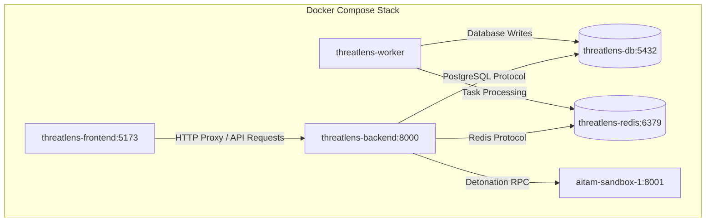

# ThreatLens Deployment & Operations Guide

ThreatLens can be run either locally via direct Python/Node processes or in production via Docker Compose.



---

## 1. Quickstart via Docker Compose

```bash
# 1. Clone and enter directory
cd AITAM

# 2. Configure environment
cp .env.example .env
# Fill in real API keys in .env

# 3. Build and launch all services
docker compose up -d --build

# 4. Access Platform
# Frontend: http://localhost:5173
# Backend API & Docs: http://localhost:8000/docs
```

---

## 2. Local Development Run

```bash
# Terminal 1: PostgreSQL & Redis
docker compose up -d db redis sandbox

# Terminal 2: Backend API
cd backend
python -m venv venv
venv\Scripts\activate  # Windows
pip install -r requirements.txt
uvicorn app.main:app --reload --port 8000

# Terminal 3: Celery Worker
cd backend
celery -A app.worker.celery_app worker --loglevel=info -P threads

# Terminal 4: Frontend
cd frontend
npm install
npm run dev
```

---

## 3. Running Test Suites

```bash
# Run unit & integration test suites
cd backend
python -m pytest tests/test_all_vectors.py -v
```
