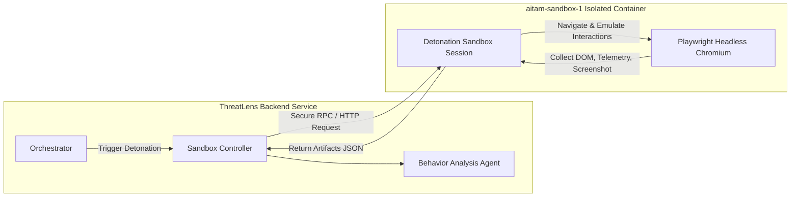

# Isolated Browser Sandbox Architecture

ThreatLens executes zero-trust dynamic URL detonation using an isolated headless Playwright browser container (`aitam-sandbox-1`).

---

## Behavioral Signals Captured
1. **Network Interceptions:** All HTTP requests, external scripts loaded, and 301/302 redirect chains.
2. **DOM Analysis:** Presence of credential input fields (`<input type="password">`), form action URLs pointing to disparate domains, hidden iframes, and fake CAPTCHA widgets.
3. **Console Telemetry:** JavaScript exceptions, unhandled rejections, and debugger evasion attempts.
4. **Visual Artifacts:** Viewport screenshots saved and securely rendered on the analyst UI.
