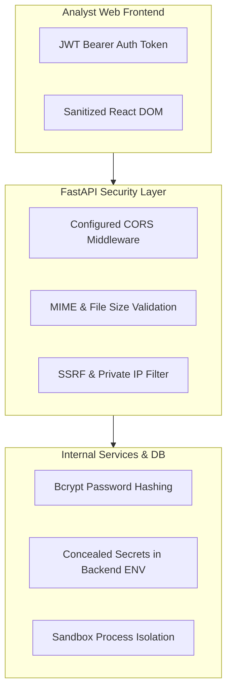

# ThreatLens Security Policy & Guarantees

ThreatLens enforces rigorous security standards across all layers of the platform.

---

## Key Security Measures

1. **Zero Exposure of API Keys:** API keys (`URLHAUS_AUTH_KEY`, `VIRUSTOTAL_API_KEY`, `GOOGLE_SAFE_BROWSING_API_KEY`) are read strictly from backend environment variables and never returned in API payloads or serialized to frontend bundles.
2. **SSRF Mitigation:** Input URLs are checked to prevent requests against RFC1918 private IP ranges (`10.0.0.0/8`, `172.16.0.0/12`, `192.168.0.0/16`, `127.0.0.1`).
3. **Safe File Uploads:** Uploaded QR code images are verified for valid image MIME types (`image/png`, `image/jpeg`, `image/webp`), restricted to a maximum size of 10MB, stored in temporary files, decoded, and immediately deleted from the filesystem.
4. **Zero-Trust Host Execution:** Untrusted URLs and QR codes are NEVER launched on the host server; all execution occurs inside isolated sandbox containers.
