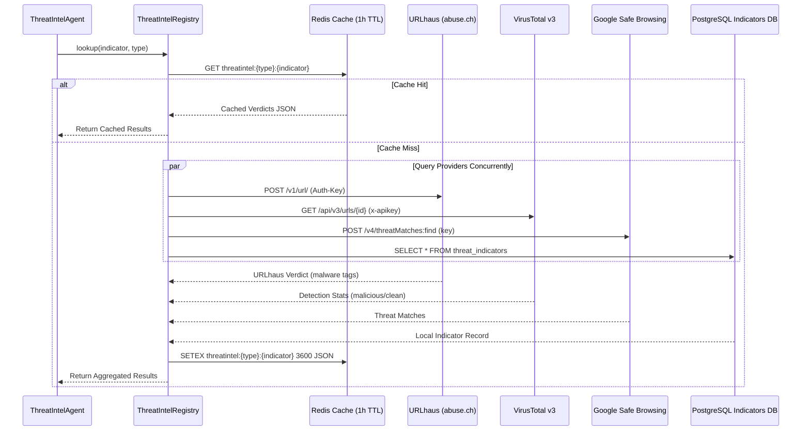

# Threat Intelligence Integration

ThreatLens features a resilient threat intelligence subsystem aggregating external security vendors, abuse feeds, and local PostgreSQL indicator caches.

---

## Supported Providers

| Provider | Supported Indicator Types | Authentication Method | Fallback Behavior |
|---|---|---|---|
| **URLhaus (`abuse.ch`)** | `URL`, `DOMAIN`, `IP`, `HASH` | `Auth-Key` Header via `URLHAUS_AUTH_KEY` | Gracefully returns `UNKNOWN` on network error / rate limit |
| **VirusTotal v3** | `URL`, `DOMAIN`, `IP`, `HASH` | `x-apikey` Header via `VIRUSTOTAL_API_KEY` | Gracefully returns `UNKNOWN` if quota exhausted |
| **Google Safe Browsing** | `URL` | API Query Key via `GOOGLE_SAFE_BROWSING_API_KEY` | Returns `UNKNOWN` on configuration omission |
| **ThreatLens Local DB** | `URL`, `DOMAIN`, `IP`, `HASH`, `EMAIL` | Direct PostgreSQL asyncpg session | Instant local matching against synchronized feed |

---

## Automated Feed Ingestion

The Celery task `sync_threat_intel_feed_task` periodically fetches recent active malicious URLs from URLhaus (`/v1/urls/recent/`), normalizes the tags, and updates the local PostgreSQL `threat_indicators` table with deduplication and updated timestamps.
